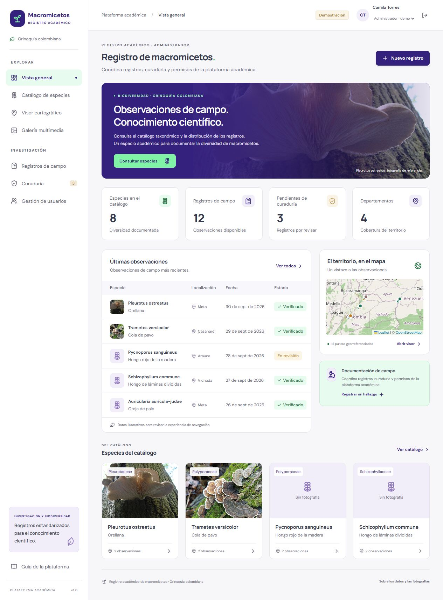

# Macromicetos · Registro académico

Plataforma web para consultar y registrar macromicetos de la Orinoquía colombiana. Organiza información taxonómica, observaciones de campo, distribución geográfica, fotografías y revisión científica, con vistas adaptadas al alcance de cada perfil.

El repositorio contiene el frontend funcional y la documentación de integración. **El backend FastAPI todavía no está implementado en este repositorio**: la aplicación inicia con datos de demostración y dispone de un cliente REST para conectarlo cuando esté disponible.



## Funcionalidades

- Vista general con métricas calculadas a partir de los registros disponibles.
- Catálogo con búsqueda, filtros por familia, ordenación y vistas de tarjetas o lista.
- Fichas de especies con taxonomía, morfología, ecología, geografía y multimedia.
- Mapa interactivo con filtros por departamento, familia, fechas y estado de revisión.
- Creación y edición de observaciones mediante formularios por pasos y exportación CSV.
- Galería y carga de fotografías asociadas a observaciones.
- Curaduría para verificar registros o solicitar ajustes con comentarios.
- Administración de usuarios y perfiles en demostración; operaciones REST configurables.
- Diseño adaptable a escritorio y móvil, con una paleta basada en [Programa Orquídeas](https://programaorquideas.minciencias.gov.co/): morado, verde menta, blanco y gris.

## Perfiles y alcance

| Perfil | Acceso |
| --- | --- |
| Visitante | Consulta catálogo, fichas, mapa y galería. |
| Investigador | Crea especies y registros; edita sus propias observaciones y les añade fotografías. |
| Curador | Revisa observaciones, las verifica o solicita ajustes. |
| Administrador | Gestiona todos los registros, curaduría, usuarios y roles. |

El investigador dispone de una vista de sus registros y métricas propias. El curador accede a la cola de revisión. El administrador tiene una visión global y puede asignar perfiles. La interfaz restringe controles y rutas; **FastAPI deberá validar identidad, rol y propiedad en cada petición**.


## Tecnologías

| Área | Herramientas |
| --- | --- |
| Interfaz | React 19 y TypeScript |
| Desarrollo y compilación | Vite 6 |
| Cartografía | Leaflet y OpenStreetMap |
| Iconos | Lucide React |
| Pruebas | Ejecutor de pruebas de Node.js |
| Backend previsto | FastAPI mediante HTTP REST |

## Instalar y ejecutar

Requisitos: Git, Node.js **20.18 o superior** compatible con las dependencias y npm. La entrega se verificó con Node.js 20.18.0 y npm 10.8.2.

```bash
git clone https://github.com/Alex012505/Macromicetos.git
cd Macromicetos/frontend
npm ci
npm run dev
```

Abre **http://127.0.0.1:5173/**. Si ya tienes el repositorio clonado, ejecuta los dos últimos comandos dentro de `frontend/`. El puerto es fijo: si está ocupado, detén la instancia anterior antes de iniciar otra.

### Comandos disponibles

Todos se ejecutan desde `frontend/`:

| Comando | Resultado |
| --- | --- |
| `npm run dev` | Inicia el entorno local. |
| `npm run build` | Comprueba TypeScript y genera la compilación en `dist/`. |
| `npm test` | Ejecuta las pruebas de transporte HTTP y permisos. |
| `npm run preview` | Sirve la compilación para revisión local. |

`preview` requiere una compilación previa e indica su URL en la terminal. La carpeta `dist/` necesita un servidor HTTP; abrir `index.html` directamente como archivo no ejecuta la aplicación correctamente.

## Modo demostración

Sin configuración adicional, la aplicación utiliza datos ilustrativos. Inicia como una administradora de demostración y permite cambiar entre los cuatro perfiles desde el encabezado, sin credenciales reales.

Las personas, observaciones, coordenadas, fechas, medidas y estados son ficticios. Las fotografías son referencias de especies y no prueban su presencia en la región. Los cambios se guardan en `localStorage` de ese navegador; no existe sincronización entre usuarios. El almacenamiento tiene capacidad limitada y la carga de imágenes en demo admite hasta 2 MB.

Esta versión es un modelo expositivo de las vistas finales. La configuración técnica de integración se conserva en archivos y documentación, sin un módulo de conexión dentro de la interfaz.

## Conectar FastAPI

Dentro de `frontend/`, copia `.env.example` como `.env`:

```powershell
Copy-Item .env.example .env
```

En macOS o Linux, usa `cp .env.example .env`. Ajusta la configuración:

```dotenv
VITE_DATA_MODE=api
VITE_API_BASE_URL=/api
API_PROXY_TARGET=http://127.0.0.1:8000
```

Reinicia Vite después de editar el archivo. En desarrollo, `/api/taxa` se redirige a `http://127.0.0.1:8000/taxa`. Si el backend tiene el prefijo `/api/v1`, configura `VITE_API_BASE_URL=/api/api/v1`: el proxy elimina únicamente el primer `/api`.

Las rutas de listado de observaciones, curaduría, usuarios, actualización de roles y refresco requieren un acuerdo de contrato y se habilitan mediante variables explícitas. La respuesta de login debe aportar un token y un perfil; la referencia HTML original únicamente declara un mensaje.

En modo API, los errores se muestran al usuario y no se sustituyen por ejemplos. Los tokens se mantienen en memoria, por lo que recargar requiere iniciar sesión otra vez. Las variables `VITE_*` son públicas: no deben contener secretos. Para producción, configura una URL HTTPS del backend o un proxy en el servidor web; el proxy de Vite es exclusivo de desarrollo.

Consulta [el contrato de integración y sus pendientes](frontend/docs/INTEGRACION_FASTAPI.md).

## Organización del repositorio

```text
Macromicetos/
├── README.md
├── .gitignore
├── .gitattributes
├── frontend/
│   ├── public/             Favicon, fotografías y créditos
│   ├── src/
│   │   ├── components/     Formularios, fichas, mapa y usuarios
│   │   ├── data/           Datos de demostración
│   │   ├── lib/            Cliente REST, transporte y permisos
│   │   ├── App.tsx         Navegación y vistas principales
│   │   ├── types.ts        Modelos del frontend
│   │   └── styles.css      Paleta y diseño adaptable
│   ├── tests/              Pruebas HTTP y permisos por perfil
│   ├── docs/               Entrega, integración, perfiles y evidencias
│   ├── .env.example        Configuración pública de ejemplo
│   ├── package.json
│   └── package-lock.json   Dependencias reproducibles
└── docs/                   Referencia HTML original de la API
```

Las referencias originales sirven para documentar el contrato; no constituyen un servidor FastAPI. El repositorio conserva las fuentes y el archivo de bloqueo. Las dependencias instaladas, compilaciones, cachés y archivos `.env` personales se excluyen de Git.

## Validación y documentación

La entrega pasó la comprobación TypeScript, la compilación de producción y **22 pruebas**: 14 del transporte HTTP, 4 de permisos y 4 de rutas de recursos para Pages. Se recorrieron las interfaces en navegador, incluidos escritorio, móvil, formularios y acceso por perfil. La conexión con una base de datos real permanece pendiente.

- [Guía técnica del frontend](frontend/README.md).
- [Perfiles, vistas y reglas de propiedad](frontend/docs/PERFILES_Y_VISTAS.md).
- [Integración con FastAPI](frontend/docs/INTEGRACION_FASTAPI.md).
- [Resultados y evidencias de validación](frontend/docs/VALIDACION.md).
- [Alcance de la entrega de frontend](frontend/docs/ENTREGA_OPCION_2.md).
- [Referencia HTML de la API](docs/index.html), para consulta local.

## Colaboración

Trabaja en una rama para cada cambio y ejecuta `npm test` y `npm run build` antes de proponer su incorporación. Mantén la adaptación de endpoints en `frontend/src/lib/api.ts` y actualiza el contrato cuando cambie una respuesta del servidor. Evita introducir datos reales en la demostración o credenciales en el repositorio.

## Recursos y atribución

Las fotografías locales cuentan con sus [créditos y licencias de origen](frontend/public/images/CREDITOS.md). El mapa utiliza OpenStreetMap con atribución visible. La cartografía y Google Fonts requieren internet; la interfaz muestra avisos de fallos del mapa y dispone de fuentes alternativas del sistema.

Este repositorio no declara una licencia para el código del proyecto. Las licencias de las fotografías y dependencias se mantienen independientes.

## Publicar en GitHub Pages

El workflow publica el modelo expositivo en https://alex012505.github.io/Macromicetos/. Primero selecciona GitHub Actions en Settings > Pages > Source. Después sube los cambios a main. Consulta la [guía de publicación y diagnóstico](frontend/docs/PUBLICACION_GITHUB_PAGES.md).
